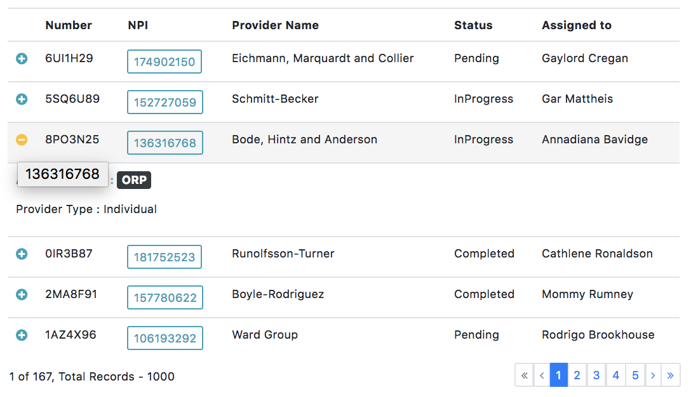

# mdata-table (responsive)
# Demo
<https://demo-mdata-table.stackblitz.io>

<https://stackblitz.com/edit/demo-mdata-table>


#Overview

This library support to angular 4, 5 and 6.  There are many options for customize your table you can customize everything cell and everything

# Installation

To install this library, run:

```bash
$ npm install mdata-table --save
```
And then in your Angular `AppModule`:

```javascript
import { BrowserModule } from '@angular/platform-browser';
import { NgModule } from '@angular/core';

import { AppComponent } from './app.component';

// Import the library
import { MDataTableModule } from 'mdata-table';

@NgModule({
  declarations: [
    AppComponent
  ],
  imports: [
    BrowserModule,

    // Specify the library as an import
    MDataTableModule.forRoot()
  ],
  providers: [],
  bootstrap: [AppComponent]
})
export class AppModule { }
```
# Features
## mdata-table *options*


| Property                | Type          | Default  | Description |
| :-----------------------| :-------------    | :------- | :---------- |
| `[indexColumn]`   | `boolean`      | `false`   | The parameter define if you want display index row by default value is `false`. |
| `[selectColumn]`      | `boolean`     | `false`   |  <p style='color:red'>It's still in development, it isn't recommended to use</p> |
| `[items]`          | `[]`     | `[]`   | The items by default is `any[] = [];` is empty. |
| `[totalPages]`         | `number`     | `0`   | The number of pages. |
| `[totalItems]`            | `number`   | `0l`   | The amount of data. |
| `[size]`          | `number`   | `10`   | The records number to show. |
| `[indexColumnHeader]`         | `string`   | `''`   | It's related to indexColumn for the header. |
| `[multiExpandableRows]`                | `boolean` | `false`   | Define when click on expand icon.   `true` -> if it's true when clicking, it stays expanded when it is expanded in the others.|
| `[classTable]`         | `string`    | `''table-condensed table-bordered''`   | The class default for table `table-condensed table-bordered`. |
| `(reload)`                | `@Output`   | `@Output` | the method define for load data example [(reload)="reloadItems($event)"](#reloadItems) . |
| `[expandableRows]`          | `boolean`   | `true`   | Define if display expandable icon for mode responsive. |
| `[rowColors]`          | `Callback`   | `null`   | Define if the row to change background color, click to see example [[rowColors]="rowColors"](#rowColors)  |
| `(rowClick)`          | `@Output`   | `@Output`   | When you do click the row return the selected row, see example [(rowClick)="rowClick($event)"](#rowClick). |
| `(rowDoubleClick)`          | `@Output`   | `@Output`   | When you do double click in the row return  the selected row,  see example [(rowDoubleClick)="rowDoubleClick($event)"](#rowDoubleClick). |
| `[rowTooltip]`          | `Callback`   | `undefined`   | [[rowTooltip]="rowTooltip"](#rowTooltip). |


### Examples

##### reloadItems
Example with a component we need to declare `items, totalItems, totalPages, size`
```javascript
import {Component, OnInit} from '@angular/core';
import {DataTableRow, DataTableResource} from 'mdata-table';
import persons from './data-table-demo';
import {Subscription} from 'rxjs/Subscription';

@Component({
  selector: 'app-home',
  templateUrl: './home.component.html',
  styleUrls: ['./home.component.css']
})
export class HomeComponent implements OnInit {

  itemResource = [];
  items = [];
  totalItems = 204;
  totalPages = 34;
  size = 6;
  index = 1;

  constructor() {
  }


  ngOnInit(): void {
    this.itemResource = new DataTableResource(persons);
  }

  reloadItems(params) {
    this.itemResource.query(params).then(items => {
      this.items = items;
    });
  }
}

```
```html
<mdata-table
              [items]="items"
			  (reload)="reloadItems($event)"
			  >
```

###### Eager loading
Sometimes we have a little data so usually we bring all data to frontend, for that we need a table eager this library has support eager
You can see in the `demo` when there are some examples using eager.
```javascript
reloadItems(params) {
    this.itemResource.query(params).then(items => {
      this.items = items;
    });
}
```
###### Lazy loading
When the API rest give us with pagination, sort and everything necessary we can use the lazy loading we can see an example below.
```javascript
reloadItems(params) {
    this.userApiService.getAllUsers({size: 7, page: params.page }).subscribe(value => {
        this.totalPages = value.json().totalPages;
        this.size = value.json().numberOfElements;
        this.items = value.json().content;
    });
  }
```
##### rowColors

```html
<mdata-table
            [rowColors]="rowColors"
			  >
```
```javascript
rowColors(item, row: DataTableRow) {
    if (item.caseNumber === 'A000000437') {
      return '#fafafa';
    }
}
```
##### rowClick
```html
<mdata-table
          (rowClick)="rowClick($event)"
			  >
```
```javascript
rowClick(rowEvent) {
    console.log('Clicked: ' + rowEvent.row.item.caseNumber);
  }
```
##### rowDoubleClick
```html
<mdata-table
         (rowDoubleClick)="rowDoubleClick($event)"
			  >
```
```javascript
rowDoubleClick(rowEvent) {
    // alert('Double clicked: ' + rowEvent.row.item.name);
  }
```
##### rowTooltip
```html
<mdata-table
       [rowTooltip]="rowTooltip"
			  >
```
```javascript
rowTooltip(item) {
    return item.NPI;
  }
```
### Template Options

##### icon expand template
```html
<mdata-table>
	 <ng-template #iconExpand let-expanded="expanded">
		  <span class="fa fa-lg fa-plus-circle text-info" *ngIf="!expanded"></span>
		  <span class="fa fa-lg fa-minus-circle text-warning" *ngIf="expanded"></span>
	 </ng-template>
 </mdata-table>
```
##### data table expand template
```html
<mdata-table>
	<ng-template #dataTableExpand let-itemExpand="itemExpand">
      <p class="text-info" *ngIf="itemExpand.NPI != null">NPI : {{itemExpand.NPI}}</p>
      <p class="text-warning" *ngIf="itemExpand.providerName != null">Provider : {{itemExpand.providerName}}</p>
      <p *ngIf="itemExpand.status != null">Status : {{itemExpand.status}}</p>
      <p *ngIf="itemExpand.assignedTo != null">Assigned to : {{itemExpand.assignedTo}}</p>
      <p *ngIf="itemExpand.applicationType != null">Application type : {{itemExpand.applicationType}}</p>
      <p *ngIf="itemExpand.providerType != null">Provider Type : {{itemExpand.providerType}}</p>
   </ng-template>
 </mdata-table>
```

## mdata-table-column options
| Property                | Type          | Default  | Description |
| :-----------------------| :-------------    | :------- | :---------- |
| `[property]`   | `string`      |   | The propertie search on data by key the value from json format data. |
| `[header]`      | `String`     |    |  The name for header |
| `[sortable]`          | `boolena`     | `false`   | The value by default is false when is true add mode sort. |
| `[visible]`         | `boolean`     | `true`   | If false the column hide and visible only mode expandable. |
| `[cellColors]`            | `Callback`   | `undefined`   | <p style='color:red'>Is still in development, it is recommended not to use it until a new version is published</p> . |

### Break points (Responsive table)
The breakpoints defined are.

```javascript
const breakpointConfig: BreakpointConfig = {
    xss: { max: 400 },
    xs: { min: 400, max: 768 },
    sm: { min: 768, max: 992 },
    md: { min: 992, max: 1200 },
    lgs: { min: 1200, max: 1500 },
    lg: { min: 1500 }
}
```
`xss` *We'll display when the screen it's how max 400px*

`xs` *We'll display when the screen it's how max 768px and minimum 400px*

`sm` *We'll display when the screen it's how max 992px and minimum 768px*

`md` *We'll display when the screen it's how max 1200px and minimum 992px*

`lgs` *We'll display when the screen it's how max 1500px and minimum 1200px*

`xs` *We'll display when the screen it's minimum 1500px*

For display a column in a size we can define with (`xss, xs, sm, md, lgs, lg`)
### Template Options for column table

##### Cell template
When we need to custom template for cell we can define the template with id `#dataTableCell` and use data with `let-item="item"`

```html
<mdata-table>
	<mdata-table-column
      [property]="'NPI'"
      [header]="'NPI'"
      [breakpoints]="'xxs,xs'"
      [sortable]="true">
      <ng-template #dataTableCell let-item="item">
        <button class="btn btn-outline-info btn-sm" (click)="buttonalert(item.NPI)">{{item.NPI}}</button>
      </ng-template>
    </mdata-table-column>
 </mdata-table>
```

##### header template
When we need to custom the template for header we can define the template with id `#dataTableHeader` and use data with `let-item="item"`

```html
<mdata-table-column
	[property]="'status'"
	[header]="'Status'"
	[breakpoints]="'xxs,xs,sm,md'"
	[sortable]="false">
	<ng-template #dataTableHeader let-item="item">
		<span style="color: rgb(232, 0, 0)">Active</span>
	</ng-template>
</mdata-table-column>
```


##### header extra template
When we need to custom template for header we can define the template with id `#dataTableHeader` and the extra templete to define id with `#dataTableHeaderExtra` and use data with `let-item="item"`

```html
<mdata-table-column
      [property]="'status'"
      [header]="'Status'"
      [breakpoints]="'xxs,xs,sm,md'"
      [sortable]="false">
      <ng-template #dataTableHeader let-item="item">
        <span style="color: rgb(232, 0, 0)">Active</span>
      </ng-template>
      <ng-template #dataTableHeaderExtra>
        <i class="fa fa-filter" aria-hidden="true"></i>
      </ng-template>
 </mdata-table-column>
```
## Use the library example
Once the library is imported, you can use it's components, directives and pipes in your Angular application:

### home.component.html

```html
<mdata-table [indexColumn]="column.indexColumn"
              [selectColumn]="column.selectColumn"
              [items]="items"
              [totalPages]="totalPages"
              [totalItems]="totalItems"
              [size]="size"
              [indexColumnHeader]="'#'"
              [multiExpandableRows]="column.multiExpandableRows"
              [classTable]="''"
              (reload)="reloadItems($event)"
              [expandableRows]="true"
              [rowColors]="rowColors"
              (rowClick)="rowClick($event)"
              (rowDoubleClick)="rowDoubleClick($event)"
              [rowTooltip]="rowTooltip">
    <ng-template #iconExpand let-expanded="expanded">
      <span class="fa fa-lg fa-plus-circle text-info" *ngIf="!expanded"></span>
      <span class="fa fa-lg fa-minus-circle text-warning" *ngIf="expanded"></span>
    </ng-template>
    <ng-template #dataTableExpand let-itemExpand="itemExpand">
      <p class="text-info" *ngIf="itemExpand.NPI != null">NPI : {{itemExpand.NPI}}</p>
      <p class="text-warning" *ngIf="itemExpand.providerName != null">Provider Name : {{itemExpand.providerName}}</p>
      <p *ngIf="itemExpand.status != null">Status : {{itemExpand.status}}</p>
      <p *ngIf="itemExpand.assignedTo != null">Assigned to : {{itemExpand.assignedTo}}</p>
      <p *ngIf="itemExpand.applicationType != null">Application type : {{itemExpand.applicationType}}</p>
      <p *ngIf="itemExpand.providerType != null">Provider Type : {{itemExpand.providerType}}</p>
    </ng-template>
    <mdata-table-column
      [property]="'caseNumber'"
      [header]="'Number'"
      [sortable]="true"
      [visible]="true"
      [cellColors]="cellColor">
    </mdata-table-column>
    <mdata-table-column
      [property]="'NPI'"
      [header]="'NPI'"
      [breakpoints]="'xxs,xs'"
      [sortable]="true">
      <ng-template #dataTableCell let-item="item">
        <button class="btn btn-outline-info btn-sm" (click)="buttonalert(item.NPI)">{{item.NPI}}</button>
      </ng-template>
    </mdata-table-column>
    <mdata-table-column
      [property]="'providerName'"
      [header]="'Provider Name'"
      [breakpoints]="'xxs,xs,sm'"
      [sortable]="true"
      [visible]="true">
    </mdata-table-column>
    <mdata-table-column
      [property]="'status'"
      [header]="'Status'"
      [breakpoints]="'xxs,xs,sm,md'"
      [sortable]="false">
      <ng-template #dataTableHeader let-item="item">
        <span style="color: rgb(232, 0, 0)">Active</span>
      </ng-template>
      <ng-template #dataTableHeaderExtra>
        <i class="fa fa-filter" aria-hidden="true"></i>
      </ng-template>
      <ng-template #dataTableCell let-item="item">
        <span style="color: grey">
          <span class="fa fa-check" *ngIf="item.status"></span>
          <span class="fa fa-close" *ngIf="!item.status"></span>
        </span>
      </ng-template>
    </mdata-table-column>
    <mdata-table-column
      [property]="'assignedTo'"
      [header]="'Assigned to'"
      [sortable]="true"
      [resizable]="true"
      [visible]="true">
    </mdata-table-column>
    <mdata-table-column
      [property]="'applicationType'"
      [header]="'Application Type'"
      [breakpoints]="'xxs,xs,sm,md'"
      [sortable]="true"
      [visible]="column.applicationType">
    </mdata-table-column>
    <mdata-table-column
      [property]="'providerType'"
      [header]="'Provider Type'"
      [breakpoints]="'xxs,xs,sm,md,lgs'"
      [sortable]="true"
      [visible]="column.providerType">
    </mdata-table-column>
  </mdata-table>
```

### home.component.ts
```javascript
import {Component, OnInit} from '@angular/core';
import {DataTableRow, DataTableResource} from 'mdata-table';
import persons from './data-table-demo';
import {Subscription} from 'rxjs/Subscription';

@Component({
  selector: 'app-home',
  templateUrl: './home.component.html',
  styleUrls: ['./home.component.css']
})
export class HomeComponent implements OnInit {

  itemResource = [];
  items = [];
  totalItems = 204;
  totalPages = 34;
  size = 6;
  index = 1;

  constructor() {
  }


  ngOnInit(): void {
    this.itemResource = new DataTableResource(persons);
  }

  reloadItems(params) {
    this.itemResource.query(params).then(items => {
      this.items = items;
    });
  }

  // special properties:
  rowClick(rowEvent) {

  }

  rowDoubleClick(rowEvent) {

  }

  rowColors(item, row: DataTableRow) {

  }

  rowTooltip(item) {

  }

  cellColor(car) {
    return '#ffffff';
  }

  buttonalert(param: any) {
    alert(param);
  }

}

```

## License

MIT © [Milver Flores Acevedo](mailto:mfflowg@gmail.com)
